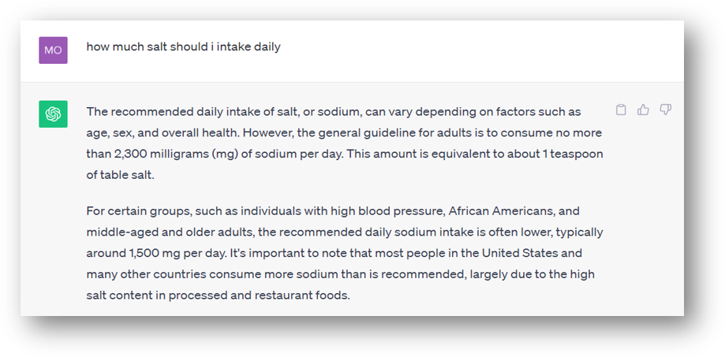
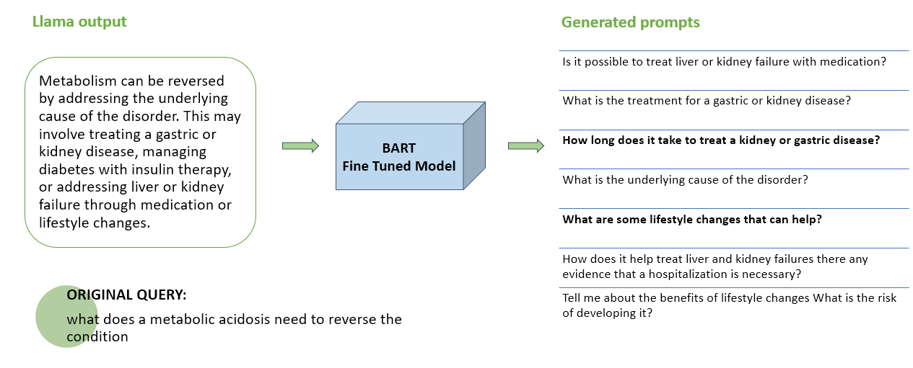

<div align="center">


# Prompt Generation with LLM to improve Proactiveness

[](https://www.python.org/downloads/release/python-390/)

[](https://pypi.org/project/rank-bm25/)

</div>

&nbsp;

# Problem Statement
<div align = "justify">
<i>
In addressing the limitations of current large language models (LLMs) which provide generic results for all users, lack efficient human involvement when generated output falls short, and struggle to discern when to personalize responses versus offering generic results in conversations, this project aims to enhance proactiveness in prompt generation, ensuring more tailored and contextually relevant interactions with users.

For Example:


</i>
</div>

# Getting started

## Setup

Clone the repo:

```bash
git clone https://github.com/satyanshu404/Prompt-Generation-with-LLM.git
```

Install the dependencies:

```bash
pip install -r requirements.txt
```

You are all set! 🎉

&nbsp;


## Proposed Solution
```bash
1. Obtain extended output from a general pre-trained LLM (e.g., Chat GPT, LLAMA)
2. Utilize a Bert-GPT Encoder-Decoder model to produce summaries of the generated content
3. Employ a BART sequence-to-sequence model to generate prompts
4. Evaluate and rank all generated prompts, presenting the top 10 options to users for obtaining more specific and detailed results
```

# Example
<div align="center">


</div>